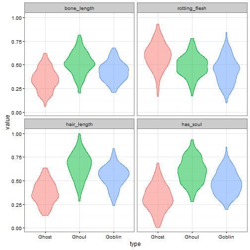
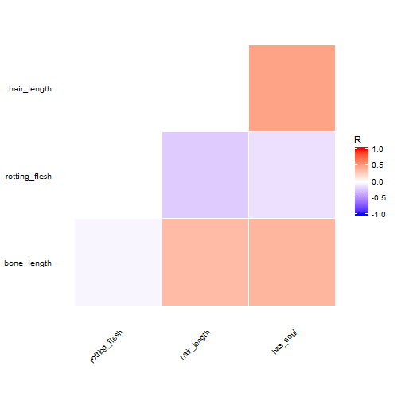
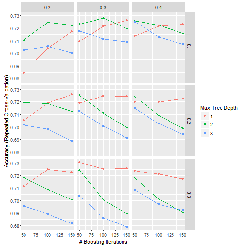

---

# Preamble

Set working directory.


```r
setwd("~/Projects/Kaggle/GhoulsGoblinsGhosts/scripts")
```

Load libraries.


```r
library(plyr)
library(dplyr)
library(reshape2)
library(ggplot2)
library(caret)
library(xgboost)
library(parallel)
library(doParallel)
```

Reproducibility steps.


```r
sessionInfo()
```

```
## R version 3.3.1 (2016-06-21)
## Platform: x86_64-w64-mingw32/x64 (64-bit)
## Running under: Windows 7 x64 (build 7601) Service Pack 1
## 
## locale:
## [1] LC_COLLATE=English_United States.1252 
## [2] LC_CTYPE=English_United States.1252   
## [3] LC_MONETARY=English_United States.1252
## [4] LC_NUMERIC=C                          
## [5] LC_TIME=English_United States.1252    
## 
## attached base packages:
## [1] parallel  stats     graphics  grDevices utils     datasets  methods  
## [8] base     
## 
## other attached packages:
##  [1] rmarkdown_1.0       knitr_1.14          checkpoint_0.3.16  
##  [4] randomForest_4.6-12 doParallel_1.0.10   iterators_1.0.8    
##  [7] foreach_1.4.3       xgboost_0.4-3       caret_6.0-71       
## [10] lattice_0.20-33     ggplot2_2.1.0       reshape2_1.4.1     
## [13] dplyr_0.5.0         plyr_1.8.4          RevoUtilsMath_8.0.3
## 
## loaded via a namespace (and not attached):
##  [1] Rcpp_0.12.6        formatR_1.4        compiler_3.3.1    
##  [4] nloptr_1.0.4       class_7.3-14       tools_3.3.1       
##  [7] digest_0.6.10      lme4_1.1-12        evaluate_0.9      
## [10] tibble_1.0         nlme_3.1-128       gtable_0.2.0      
## [13] mgcv_1.8-12        Matrix_1.2-6       DBI_0.5           
## [16] SparseM_1.7        e1071_1.6-7        stringr_1.0.0     
## [19] RevoUtils_10.0.1   MatrixModels_0.4-1 stats4_3.3.1      
## [22] grid_3.3.1         nnet_7.3-12        data.table_1.9.6  
## [25] R6_2.1.2           minqa_1.2.4        car_2.1-3         
## [28] magrittr_1.5       htmltools_0.3.5    scales_0.4.0      
## [31] codetools_0.2-14   MASS_7.3-45        splines_3.3.1     
## [34] assertthat_0.1     pbkrtest_0.4-6     colorspace_1.2-6  
## [37] labeling_0.3       quantreg_5.26      stringi_1.1.1     
## [40] lazyeval_0.2.0     munsell_0.4.3      chron_2.3-47
```

```r
set.seed(as.integer(as.Date("2016-11-04")))
```

Source user-defined functions.


```r
sapply(list.files("../lib", full.names = TRUE), source)
```

```
## named list()
```

---

# Read data

Read the data stored locally.


```r
unzip("../data/raw/train.csv.zip", exdir = tempdir())
train <- read.csv(file.path(tempdir(), "train.csv"), stringsAsFactors = TRUE)
unzip("../data/raw/test.csv.zip", exdir = tempdir())
test <- read.csv(file.path(tempdir(), "test.csv"), stringsAsFactors = TRUE)
```

List the columns in both data sets.


```r
merge(data.frame(col = names(train), inTrain = TRUE),
      data.frame(col = names(test), inTest = TRUE),
      by = "col", all = TRUE) %>%
  filter(inTrain & inTest) %>%
  .[, "col"]
```

```
## [1] bone_length   color         hair_length   has_soul      id           
## [6] rotting_flesh
## 7 Levels: bone_length color hair_length has_soul id ... type
```

Check that the columns in `train` are the same as in `test`.
Show the columns that are not in both data sets.


```r
merge(data.frame(col = names(train), inTrain = TRUE),
      data.frame(col = names(test), inTest = TRUE),
      by = "col", all = TRUE) %>%
  filter(is.na(inTrain) | is.na(inTest))
```

```
##    col inTrain inTest
## 1 type    TRUE     NA
```

---

# Explore sample

Describe the `type` variable.


```r
tab <- table(train$type)
data.frame(cbind(freq = tab, prop = prop.table(tab)))
```

```
##        freq      prop
## Ghost   117 0.3153639
## Ghoul   129 0.3477089
## Goblin  125 0.3369272
```

Plot densities between `type` and the numeric variables.
Look for patterns or clusterings.


```r
numvar <- names(train)[sapply(train, class) == "numeric"]
melt(train, id.vars = "type", measure.vars = numvar) %>%
  ggplot(aes(x = type, y = value, group = type, color = type, fill = type)) +
    geom_violin(alpha = 1/2) +
    facet_wrap(~ variable) +
    theme_bw() +
    theme(legend.position = "none")
```



Show summary statistics for numeric variables.


```r
select(train, matches(paste(numvar, collapse = "|"))) %>% summary()
```

```
##   bone_length      rotting_flesh      hair_length        has_soul       
##  Min.   :0.06103   Min.   :0.09569   Min.   :0.1346   Min.   :0.009402  
##  1st Qu.:0.34001   1st Qu.:0.41481   1st Qu.:0.4074   1st Qu.:0.348002  
##  Median :0.43489   Median :0.50155   Median :0.5386   Median :0.466372  
##  Mean   :0.43416   Mean   :0.50685   Mean   :0.5291   Mean   :0.471392  
##  3rd Qu.:0.51722   3rd Qu.:0.60398   3rd Qu.:0.6472   3rd Qu.:0.600610  
##  Max.   :0.81700   Max.   :0.93247   Max.   :1.0000   Max.   :0.935721
```

Show the standard deviations of the numeric variables.


```r
select(train, matches(paste(numvar, collapse = "|"))) %>% var() %>% diag() %>% sqrt()
```

```
##   bone_length rotting_flesh   hair_length      has_soul 
##     0.1328331     0.1463577     0.1699018     0.1761293
```

The numeric variables are pre-scaled with values between 0.00940161587866194, 1.
Therefore, no preprocessing is needed.

Plot bivariate densities between numeric variables.
Look for correlations to reduce dimensionality of data.


```r
corr <-
  select(train, matches(paste(numvar, collapse = "|"))) %>%
  cor()
contHighCorr <- colnames(corr)[findCorrelation(corr)]
sprintf("Remove variable due to high pair-wise correlation with other variables: %s",
        contHighCorr)
```

```
## character(0)
```

```r
replace(corr, which(upper.tri(corr, diag = TRUE)), NA) %>%
  melt(na.rm = TRUE) %>%
  ggplot(aes(x = Var1, y = Var2, fill = value)) + 
    geom_tile(color = "white") +
    scale_fill_gradient2(low = "blue",
                         high = "red",
                         mid = "white",
                         midpoint = 0,
                         limit = c(-1, 1),
                         space = "Lab",
                         name="R") +
    theme_minimal() +
    theme(axis.text.x = element_text(angle = 45, vjust = 1, hjust = 1),
          axis.title.x = element_blank(),
          axis.title.y = element_blank(),
          panel.grid.major = element_blank()) +
    coord_fixed()
```



```r
round(corr, 2)
```

```
##               bone_length rotting_flesh hair_length has_soul
## bone_length          1.00         -0.04        0.35     0.38
## rotting_flesh       -0.04          1.00       -0.22    -0.13
## hair_length          0.35         -0.22        1.00     0.47
## has_soul             0.38         -0.13        0.47     1.00
```

Examine association between `color` and `type`.


```r
table(train$color)
```

```
## 
## black blood  blue clear green white 
##    41    12    19   120    42   137
```

```r
table(train$color, train$type) %>%
  prop.table(margin = 1)
```

```
##        
##             Ghost     Ghoul    Goblin
##   black 0.3414634 0.3414634 0.3170732
##   blood 0.5000000 0.3333333 0.1666667
##   blue  0.3157895 0.3157895 0.3684211
##   clear 0.2666667 0.3500000 0.3833333
##   green 0.3571429 0.3095238 0.3333333
##   white 0.3211679 0.3649635 0.3138686
```

---

# Model on `train`

Set the control parameters.


```r
ctrl <- trainControl(method = "cv",
                     number = 10,
                     classProbs=TRUE,
                     savePredictions = TRUE,
                     allowParallel = FALSE)
```

Set the model.


```r
method <- "xgbTree"
```

Set the tuning grid for model xgbTree.


```r
grid <- expand.grid(nrounds = seq(50, 150, 50), 
                    max_depth = 1:3, 
                    eta = seq(0.1, 0.4, 0.1), 
                    gamma = 0, 
                    colsample_bytree = seq(0.3, 0.7, 0.1), 
                    min_child_weight = 1)
```

Fit model over the tuning parameters.


```r
trainingModel <- train(type ~ .,
                       data = select(train, -matches("id")),
                       method = method,
                       trControl = ctrl,
                       tuneGrid = grid)
```

Evaluate the model on the training dataset.


```r
trainingModel
```

```
## eXtreme Gradient Boosting 
## 
## 371 samples
##   5 predictor
##   3 classes: 'Ghost', 'Ghoul', 'Goblin' 
## 
## No pre-processing
## Resampling: Cross-Validated (10 fold) 
## Summary of sample sizes: 336, 333, 334, 334, 333, 334, ... 
## Resampling results across tuning parameters:
## 
##   eta  max_depth  colsample_bytree  nrounds  Accuracy   Kappa    
##   0.1  1          0.3                50      0.7055903  0.5582144
##   0.1  1          0.3               100      0.7411299  0.6116595
##   0.1  1          0.3               150      0.7357956  0.6037514
##   0.1  1          0.4                50      0.7137939  0.5707966
##   0.1  1          0.4               100      0.7328673  0.5991899
##   0.1  1          0.4               150      0.7381305  0.6068692
##   0.1  1          0.5                50      0.7086019  0.5627991
##   0.1  1          0.5               100      0.7301646  0.5952180
##   0.1  1          0.5               150      0.7329384  0.5992368
##   0.1  1          0.6                50      0.7221987  0.5833909
##   0.1  1          0.6               100      0.7328673  0.5991866
##   0.1  1          0.6               150      0.7327962  0.5988637
##   0.1  1          0.7                50      0.7166389  0.5751126
##   0.1  1          0.7               100      0.7274619  0.5911787
##   0.1  1          0.7               150      0.7354278  0.6028425
##   0.1  2          0.3                50      0.7116846  0.5671928
##   0.1  2          0.3               100      0.7193538  0.5787259
##   0.1  2          0.3               150      0.7354156  0.6029816
##   0.1  2          0.4                50      0.7248303  0.5869241
##   0.1  2          0.4               100      0.7217476  0.5822713
##   0.1  2          0.4               150      0.7273075  0.5906442
##   0.1  2          0.5                50      0.7381305  0.6070569
##   0.1  2          0.5               100      0.7353444  0.6026264
##   0.1  2          0.5               150      0.7246759  0.5864638
##   0.1  2          0.6                50      0.7354278  0.6030423
##   0.1  2          0.6               100      0.7298679  0.5942136
##   0.1  2          0.6               150      0.7194127  0.5785176
##   0.1  2          0.7                50      0.7246048  0.5868246
##   0.1  2          0.7               100      0.7303902  0.5951261
##   0.1  2          0.7               150      0.7088275  0.5627748
##   0.1  3          0.3                50      0.7246759  0.5868416
##   0.1  3          0.3               100      0.7140073  0.5708185
##   0.1  3          0.3               150      0.7003272  0.5500080
##   0.1  3          0.4                50      0.7086019  0.5627253
##   0.1  3          0.4               100      0.7004227  0.5502991
##   0.1  3          0.4               150      0.6952185  0.5423558
##   0.1  3          0.5                50      0.7299390  0.5949327
##   0.1  3          0.5               100      0.7276753  0.5913189
##   0.1  3          0.5               150      0.7223410  0.5831223
##   0.1  3          0.6                50      0.7354989  0.6031867
##   0.1  3          0.6               100      0.7113757  0.5666939
##   0.1  3          0.6               150      0.7113635  0.5668208
##   0.1  3          0.7                50      0.7275208  0.5911455
##   0.1  3          0.7               100      0.7165556  0.5745781
##   0.1  3          0.7               150      0.7140662  0.5707303
##   0.2  1          0.3                50      0.7489413  0.6232032
##   0.2  1          0.3               100      0.7384271  0.6073206
##   0.2  1          0.3               150      0.7409043  0.6109709
##   0.2  1          0.4                50      0.7382849  0.6072451
##   0.2  1          0.4               100      0.7409754  0.6112361
##   0.2  1          0.4               150      0.7354989  0.6030338
##   0.2  1          0.5                50      0.7273786  0.5908832
##   0.2  1          0.5               100      0.7409043  0.6111110
##   0.2  1          0.5               150      0.7219854  0.5825911
##   0.2  1          0.6                50      0.7328673  0.5993285
##   0.2  1          0.6               100      0.7354156  0.6029078
##   0.2  1          0.6               150      0.7354989  0.6029971
##   0.2  1          0.7                50      0.7354989  0.6031285
##   0.2  1          0.7               100      0.7327962  0.5989888
##   0.2  1          0.7               150      0.7272363  0.5905408
##   0.2  2          0.3                50      0.7029709  0.5541394
##   0.2  2          0.3               100      0.7140784  0.5706576
##   0.2  2          0.3               150      0.7194005  0.5787127
##   0.2  2          0.4                50      0.7217476  0.5822266
##   0.2  2          0.4               100      0.7194838  0.5787496
##   0.2  2          0.4               150      0.7086608  0.5624405
##   0.2  2          0.5                50      0.7218309  0.5822755
##   0.2  2          0.5               100      0.7033266  0.5545466
##   0.2  2          0.5               150      0.7010750  0.5512327
##   0.2  2          0.6                50      0.7245336  0.5862338
##   0.2  2          0.6               100      0.7170778  0.5753499
##   0.2  2          0.6               150      0.7305913  0.5955550
##   0.2  2          0.7                50      0.7218187  0.5823178
##   0.2  2          0.7               100      0.7009327  0.5509809
##   0.2  2          0.7               150      0.7061004  0.5585452
##   0.2  3          0.3                50      0.7061837  0.5587917
##   0.2  3          0.3               100      0.6926702  0.5386688
##   0.2  3          0.3               150      0.6928124  0.5389315
##   0.2  3          0.4                50      0.7083642  0.5622383
##   0.2  3          0.4               100      0.7115058  0.5669372
##   0.2  3          0.4               150      0.7034688  0.5549581
##   0.2  3          0.5                50      0.7166267  0.5744750
##   0.2  3          0.5               100      0.7087320  0.5626316
##   0.2  3          0.5               150      0.6979212  0.5462162
##   0.2  3          0.6                50      0.7140784  0.5708823
##   0.2  3          0.6               100      0.7090408  0.5632035
##   0.2  3          0.6               150      0.7037066  0.5550877
##   0.2  3          0.7                50      0.7194838  0.5788802
##   0.2  3          0.7               100      0.7061837  0.5587910
##   0.2  3          0.7               150      0.7033977  0.5545862
##   0.3  1          0.3                50      0.7380593  0.6068456
##   0.3  1          0.3               100      0.7382016  0.6069893
##   0.3  1          0.3               150      0.7273786  0.5908151
##   0.3  1          0.4                50      0.7409754  0.6112333
##   0.3  1          0.4               100      0.7354989  0.6029211
##   0.3  1          0.4               150      0.7247470  0.5869592
##   0.3  1          0.5                50      0.7382016  0.6071541
##   0.3  1          0.5               100      0.7328673  0.5990647
##   0.3  1          0.5               150      0.7164011  0.5742681
##   0.3  1          0.6                50      0.7354989  0.6030235
##   0.3  1          0.6               100      0.7382727  0.6070972
##   0.3  1          0.6               150      0.7163300  0.5741449
##   0.3  1          0.7                50      0.7273075  0.5909344
##   0.3  1          0.7               100      0.7272363  0.5905816
##   0.3  1          0.7               150      0.7217476  0.5821395
##   0.3  2          0.3                50      0.7191872  0.5783525
##   0.3  2          0.3               100      0.7142207  0.5705546
##   0.3  2          0.3               150      0.7061004  0.5586831
##   0.3  2          0.4                50      0.7246759  0.5865253
##   0.3  2          0.4               100      0.7170778  0.5751473
##   0.3  2          0.4               150      0.7064093  0.5591158
##   0.3  2          0.5                50      0.7084597  0.5618068
##   0.3  2          0.5               100      0.6956696  0.5428244
##   0.3  2          0.5               150      0.6983723  0.5468467
##   0.3  2          0.6                50      0.7141496  0.5710445
##   0.3  2          0.6               100      0.7254826  0.5876952
##   0.3  2          0.6               150      0.7094087  0.5635334
##   0.3  2          0.7                50      0.7086019  0.5624499
##   0.3  2          0.7               100      0.7091953  0.5631258
##   0.3  2          0.7               150      0.6982178  0.5466457
##   0.3  3          0.3                50      0.7030177  0.5538580
##   0.3  3          0.3               100      0.6951351  0.5421188
##   0.3  3          0.3               150      0.6950640  0.5418564
##   0.3  3          0.4                50      0.7085186  0.5624778
##   0.3  3          0.4               100      0.6928958  0.5389306
##   0.3  3          0.4               150      0.6955273  0.5427378
##   0.3  3          0.5                50      0.7139951  0.5706171
##   0.3  3          0.5               100      0.6979212  0.5465443
##   0.3  3          0.5               150      0.7006239  0.5505832
##   0.3  3          0.6                50      0.6952185  0.5422838
##   0.3  3          0.6               100      0.6952185  0.5423549
##   0.3  3          0.6               150      0.6927291  0.5386343
##   0.3  3          0.7                50      0.7061837  0.5588695
##   0.3  3          0.7               100      0.6931924  0.5390221
##   0.3  3          0.7               150      0.7066348  0.5592918
##   0.4  1          0.3                50      0.7463930  0.6193606
##   0.4  1          0.3               100      0.7300813  0.5949581
##   0.4  1          0.3               150      0.7193416  0.5787354
##   0.4  1          0.4                50      0.7356533  0.6031319
##   0.4  1          0.4               100      0.7244503  0.5864267
##   0.4  1          0.4               150      0.7164011  0.5741086
##   0.4  1          0.5                50      0.7354278  0.6027574
##   0.4  1          0.5               100      0.7272241  0.5905347
##   0.4  1          0.5               150      0.7191038  0.5782357
##   0.4  1          0.6                50      0.7381305  0.6069575
##   0.4  1          0.6               100      0.7191872  0.5785417
##   0.4  1          0.6               150      0.7136984  0.5700183
##   0.4  1          0.7                50      0.7327962  0.5989406
##   0.4  1          0.7               100      0.7325584  0.5985805
##   0.4  1          0.7               150      0.7136984  0.5700142
##   0.4  2          0.3                50      0.7248181  0.5868694
##   0.4  2          0.3               100      0.7142207  0.5707653
##   0.4  2          0.3               150      0.7118147  0.5669711
##   0.4  2          0.4                50      0.7113046  0.5665553
##   0.4  2          0.4               100      0.6955273  0.5428629
##   0.4  2          0.4               150      0.7011583  0.5512237
##   0.4  2          0.5                50      0.7166978  0.5747230
##   0.4  2          0.5               100      0.6954440  0.5424662
##   0.4  2          0.5               150      0.6931802  0.5390715
##   0.4  2          0.6                50      0.7088864  0.5630831
##   0.4  2          0.6               100      0.7064926  0.5590342
##   0.4  2          0.6               150      0.6957407  0.5429234
##   0.4  2          0.7                50      0.7171611  0.5754208
##   0.4  2          0.7               100      0.7093375  0.5635264
##   0.4  2          0.7               150      0.6985978  0.5472438
##   0.4  3          0.3                50      0.6953607  0.5424441
##  [ reached getOption("max.print") -- omitted 14 rows ]
## 
## Tuning parameter 'gamma' was held constant at a value of 0
## 
## Tuning parameter 'min_child_weight' was held constant at a value of 1
## Accuracy was used to select the optimal model using  the largest value.
## The final values used for the model were nrounds = 50, max_depth = 1,
##  eta = 0.2, gamma = 0, colsample_bytree = 0.3 and min_child_weight = 1.
```

```r
ggplot(trainingModel)
```



```r
hat <-
  train %>%
  transform(hat = predict(trainingModel, train)) %>%
  select(matches("type|hat"))
postResample(hat$hat, hat$type)
```

```
##  Accuracy     Kappa 
## 0.7951482 0.6925392
```

```r
confusionMatrix(hat$hat, hat$type)
```

```
## Confusion Matrix and Statistics
## 
##           Reference
## Prediction Ghost Ghoul Goblin
##     Ghost    105     3     11
##     Ghoul      0   102     26
##     Goblin    12    24     88
## 
## Overall Statistics
##                                           
##                Accuracy : 0.7951          
##                  95% CI : (0.7504, 0.8351)
##     No Information Rate : 0.3477          
##     P-Value [Acc > NIR] : <2e-16          
##                                           
##                   Kappa : 0.6925          
##  Mcnemar's Test P-Value : 0.373           
## 
## Statistics by Class:
## 
##                      Class: Ghost Class: Ghoul Class: Goblin
## Sensitivity                0.8974       0.7907        0.7040
## Specificity                0.9449       0.8926        0.8537
## Pos Pred Value             0.8824       0.7969        0.7097
## Neg Pred Value             0.9524       0.8889        0.8502
## Prevalence                 0.3154       0.3477        0.3369
## Detection Rate             0.2830       0.2749        0.2372
## Detection Prevalence       0.3208       0.3450        0.3342
## Balanced Accuracy          0.9212       0.8416        0.7788
```

```r
varImp(trainingModel)
```

```
## xgbTree variable importance
## 
##                Overall
## hair_length   100.0000
## has_soul       89.9399
## bone_length    45.1959
## rotting_flesh  44.8033
## colorblood      0.8959
## colorclear      0.3235
## colorwhite      0.2083
## colorblue       0.0000
```

Display the final model.


```r
trainingModel$finalModel
```

```
## $handle
## <pointer: 0x00000000002547e0>
## attr(,"class")
## [1] "xgb.Booster.handle"
## 
## $raw
##    [1] 00 00 00 3f 09 00 00 00 03 00 00 00 00 00 00 00 00 00 00 00 00 00 00
##   [24] 00 00 00 00 00 00 00 00 00 00 00 00 00 00 00 00 00 00 00 00 00 00 00
##   [47] 00 00 00 00 00 00 00 00 00 00 00 00 00 00 00 00 00 00 00 00 00 00 00
##   [70] 00 00 00 00 00 00 00 00 00 00 00 00 00 00 00 00 00 00 00 00 00 00 00
##   [93] 00 00 00 00 00 00 00 00 00 00 00 00 00 00 00 00 00 00 00 00 00 00 00
##  [116] 00 00 00 00 00 00 00 00 00 00 00 00 00 00 00 00 00 00 00 00 00 0e 00
##  [139] 00 00 00 00 00 00 6d 75 6c 74 69 3a 73 6f 66 74 70 72 6f 62 06 00 00
##  [162] 00 00 00 00 00 67 62 74 72 65 65 96 00 00 00 00 00 00 00 09 00 00 00
##  [185] 00 00 00 00 00 00 00 00 00 00 00 00 03 00 00 00 00 00 00 00 00 00 00
##  [208] 00 00 00 00 00 00 00 00 00 00 00 00 00 00 00 00 00 00 00 00 00 00 00
##  [231] 00 00 00 00 00 00 00 00 00 00 00 00 00 00 00 00 00 00 00 00 00 00 00
##  [254] 00 00 00 00 00 00 00 00 00 00 00 00 00 00 00 00 00 00 00 00 00 00 00
##  [277] 00 00 00 00 00 00 00 00 00 00 00 00 00 00 00 00 00 00 00 00 00 00 00
##  [300] 00 00 00 00 00 00 00 00 00 00 00 00 00 00 00 00 00 00 00 00 00 00 00
##  [323] 00 00 00 00 00 00 00 00 00 00 01 00 00 00 03 00 00 00 00 00 00 00 00
##  [346] 00 00 00 09 00 00 00 00 00 00 00 00 00 00 00 00 00 00 00 00 00 00 00
##  [369] 00 00 00 00 00 00 00 00 00 00 00 00 00 00 00 00 00 00 00 00 00 00 00
##  [392] 00 00 00 00 00 00 00 00 00 00 00 00 00 00 00 00 00 00 00 00 00 00 00
##  [415] 00 00 00 00 00 00 00 00 00 00 00 00 00 00 00 00 00 00 00 00 00 00 00
##  [438] 00 00 00 00 00 00 00 00 00 00 00 00 00 00 00 00 00 00 00 00 00 00 00
##  [461] 00 00 00 00 00 00 00 00 00 00 00 00 00 00 00 00 00 00 00 00 ff ff ff
##  [484] ff 01 00 00 00 02 00 00 00 01 00 00 80 88 75 1a 3f 00 00 00 80 ff ff
##  [507] ff ff ff ff ff ff 00 00 00 00 55 9e 62 bd 00 00 00 00 ff ff ff ff ff
##  [530] ff ff ff 00 00 00 00 7f 74 04 3e a0 fc d8 41 8e e3 24 43 bd 9b 24 bd
##  [553] 02 00 00 00 00 00 00 00 e3 38 f6 42 f5 a2 8d be 00 00 00 00 00 00 00
##  [576] 00 71 1c 27 42 9e 91 25 3f 00 00 00 00 01 00 00 00 03 00 00 00 00 00
##  [599] 00 00 00 00 00 00 09 00 00 00 00 00 00 00 00 00 00 00 00 00 00 00 00
##  [622] 00 00 00 00 00 00 00 00 00 00 00 00 00 00 00 00 00 00 00 00 00 00 00
##  [645] 00 00 00 00 00 00 00 00 00 00 00 00 00 00 00 00 00 00 00 00 00 00 00
##  [668] 00 00 00 00 00 00 00 00 00 00 00 00 00 00 00 00 00 00 00 00 00 00 00
##  [691] 00 00 00 00 00 00 00 00 00 00 00 00 00 00 00 00 00 00 00 00 00 00 00
##  [714] 00 00 00 00 00 00 00 00 00 00 00 00 00 00 00 00 00 00 00 00 00 00 00
##  [737] ff ff ff ff 01 00 00 00 02 00 00 00 02 00 00 80 ec 4d 2d 3f 00 00 00
##  [760] 80 ff ff ff ff ff ff ff ff 00 00 00 00 6a 6b 51 bd 00 00 00 00 ff ff
##  [783] ff ff ff ff ff ff 00 00 00 00 ca b3 6d 3e de b0 58 42 8e e3 24 43 b5
##  [806] af 03 3d 02 00 00 00 00 00 00 00 ff ff 03 43 22 e3 82 be 00 00 00 00
##  [829] 00 00 00 00 38 8e 03 42 5e 90 94 3f 00 00 00 00 01 00 00 00 03 00 00
##  [852] 00 00 00 00 00 00 00 00 00 09 00 00 00 00 00 00 00 00 00 00 00 00 00
##  [875] 00 00 00 00 00 00 00 00 00 00 00 00 00 00 00 00 00 00 00 00 00 00 00
##  [898] 00 00 00 00 00 00 00 00 00 00 00 00 00 00 00 00 00 00 00 00 00 00 00
##  [921] 00 00 00 00 00 00 00 00 00 00 00 00 00 00 00 00 00 00 00 00 00 00 00
##  [944] 00 00 00 00 00 00 00 00 00 00 00 00 00 00 00 00 00 00 00 00 00 00 00
##  [967] 00 00 00 00 00 00 00 00 00 00 00 00 00 00 00 00 00 00 00 00 00 00 00
##  [990] 00 00 00 ff ff ff ff 01 00 00 00
##  [ reached getOption("max.print") -- omitted 38332 entries ]
## 
## $xNames
## [1] "bone_length"   "rotting_flesh" "hair_length"   "has_soul"     
## [5] "colorblood"    "colorblue"     "colorclear"    "colorgreen"   
## [9] "colorwhite"   
## 
## $problemType
## [1] "Classification"
## 
## $tuneValue
##    nrounds max_depth eta gamma colsample_bytree min_child_weight
## 46      50         1 0.2     0              0.3                1
## 
## $obsLevels
## [1] "Ghost"  "Ghoul"  "Goblin"
## attr(,"ordered")
## [1] FALSE
## 
## attr(,"class")
## [1] "xgb.Booster"
```

---

# Predict on `test`

Apply the model to the `test` data.


```r
hat <-
  test %>%
  transform(type = predict(trainingModel, test)) %>%
  select(matches("id|type"))
dim(hat)
```

```
## [1] 529   2
```

```r
str(hat)
```

```
## 'data.frame':	529 obs. of  2 variables:
##  $ id  : int  3 6 9 10 13 14 15 16 17 18 ...
##  $ type: Factor w/ 3 levels "Ghost","Ghoul",..: 2 3 2 1 1 1 2 2 3 3 ...
```

```r
head(hat)
```

```
##   id   type
## 1  3  Ghoul
## 2  6 Goblin
## 3  9  Ghoul
## 4 10  Ghost
## 5 13  Ghost
## 6 14  Ghost
```

Describe the `type` variable.


```r
tab <- table(hat$type)
data.frame(cbind(freq = tab, prop = prop.table(tab)))
```

```
##        freq      prop
## Ghost   187 0.3534972
## Ghoul   173 0.3270321
## Goblin  169 0.3194707
```

Save the predictions to file.


```r
options(scipen = 10)
write.csv(hat, file = "../data/processed/submission.csv", row.names = FALSE, quote = FALSE)
file.info("../data/processed/submission.csv")
```

```
##                                  size isdir mode               mtime
## ../data/processed/submission.csv 5944 FALSE  666 2016-11-05 09:10:19
##                                                ctime               atime
## ../data/processed/submission.csv 2016-11-05 08:42:09 2016-11-05 08:42:09
##                                  exe
## ../data/processed/submission.csv  no
```
