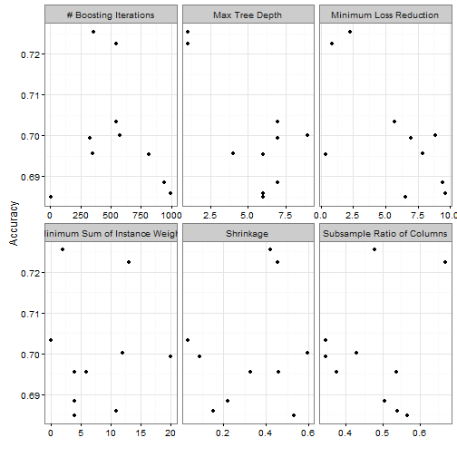

---

# Preamble

Set working directory.


```r
setwd("~/Projects/Kaggle/GhoulsGoblinsGhosts/scripts")
```

Load libraries.


```r
library(plyr)
library(dplyr)
library(reshape2)
library(ggplot2)
library(caret)
library(parallel)
library(doParallel)
```

Reproducibility steps.


```r
sessionInfo()
```

```
## R version 3.3.1 (2016-06-21)
## Platform: x86_64-w64-mingw32/x64 (64-bit)
## Running under: Windows 7 x64 (build 7601) Service Pack 1
## 
## locale:
## [1] LC_COLLATE=English_United States.1252 
## [2] LC_CTYPE=English_United States.1252   
## [3] LC_MONETARY=English_United States.1252
## [4] LC_NUMERIC=C                          
## [5] LC_TIME=English_United States.1252    
## 
## attached base packages:
## [1] splines   parallel  stats     graphics  grDevices utils     datasets 
## [8] methods   base     
## 
## other attached packages:
##  [1] xgboost_0.4-4       bst_0.3-14          gbm_2.1.1          
##  [4] survival_2.39-5     doParallel_1.0.10   iterators_1.0.8    
##  [7] foreach_1.4.3       caret_6.0-71        lattice_0.20-34    
## [10] ggplot2_2.1.0       reshape2_1.4.1      dplyr_0.5.0        
## [13] plyr_1.8.4          rmarkdown_1.0       knitr_1.14         
## [16] checkpoint_0.3.16   RevoUtilsMath_8.0.3
## 
## loaded via a namespace (and not attached):
##  [1] RevoUtils_10.0.1   colorspace_1.2-7   htmltools_0.3.5   
##  [4] stats4_3.3.1       mgcv_1.8-15        chron_2.3-47      
##  [7] e1071_1.6-7        nloptr_1.0.4       DBI_0.5-1         
## [10] stringr_1.1.0      MatrixModels_0.4-1 munsell_0.4.3     
## [13] gtable_0.2.0       codetools_0.2-15   evaluate_0.9      
## [16] labeling_0.3       SparseM_1.72       quantreg_5.29     
## [19] pbkrtest_0.4-6     class_7.3-14       Rcpp_0.12.7       
## [22] scales_0.4.0       formatR_1.4        lme4_1.1-12       
## [25] digest_0.6.10      stringi_1.1.1      grid_3.3.1        
## [28] tools_3.3.1        magrittr_1.5       lazyeval_0.2.0    
## [31] tibble_1.2         car_2.1-3          MASS_7.3-45       
## [34] Matrix_1.2-7.1     data.table_1.9.6   pROC_1.8          
## [37] assertthat_0.1     minqa_1.2.4        R6_2.2.0          
## [40] rpart_4.1-10       nnet_7.3-12        nlme_3.1-128      
## [43] compiler_3.3.1
```

```r
set.seed(as.integer(as.Date("2016-11-04")))
```

Source user-defined functions.


```r
sapply(list.files("../lib", full.names = TRUE), source)
```

```
## named list()
```

---

# Read data

Read the data stored locally.


```r
unzip("../data/raw/train.csv.zip", exdir = tempdir())
train <- read.csv(file.path(tempdir(), "train.csv"), stringsAsFactors = TRUE)
unzip("../data/raw/test.csv.zip", exdir = tempdir())
test <- read.csv(file.path(tempdir(), "test.csv"), stringsAsFactors = TRUE)
```

List the columns in both data sets.


```r
merge(data.frame(col = names(train), inTrain = TRUE),
      data.frame(col = names(test), inTest = TRUE),
      by = "col", all = TRUE) %>%
  filter(inTrain & inTest) %>%
  .[, "col"]
```

```
## [1] bone_length   color         hair_length   has_soul      id           
## [6] rotting_flesh
## 7 Levels: bone_length color hair_length has_soul id ... type
```

Check that the columns in `train` are the same as in `test`.
Show the columns that are not in both data sets.


```r
merge(data.frame(col = names(train), inTrain = TRUE),
      data.frame(col = names(test), inTest = TRUE),
      by = "col", all = TRUE) %>%
  filter(is.na(inTrain) | is.na(inTest))
```

```
##    col inTrain inTest
## 1 type    TRUE     NA
```

---

# Explore sample

Describe the `type` variable.


```r
tab <- table(train$type)
data.frame(cbind(freq = tab, prop = prop.table(tab)))
```

```
##        freq      prop
## Ghost   117 0.3153639
## Ghoul   129 0.3477089
## Goblin  125 0.3369272
```

Plot densities between `type` and the numeric variables.
Look for patterns or clusterings.


```r
numvar <- names(train)[sapply(train, class) == "numeric"]
melt(train, id.vars = "type", measure.vars = numvar) %>%
  ggplot(aes(x = type, y = value, group = type, color = type, fill = type)) +
    geom_violin(alpha = 1/2) +
    facet_wrap(~ variable) +
    theme_bw() +
    theme(legend.position = "none")
```


Show summary statistics for numeric variables.


```r
select(train, matches(paste(numvar, collapse = "|"))) %>% summary()
```

```
##   bone_length      rotting_flesh      hair_length        has_soul       
##  Min.   :0.06103   Min.   :0.09569   Min.   :0.1346   Min.   :0.009402  
##  1st Qu.:0.34001   1st Qu.:0.41481   1st Qu.:0.4074   1st Qu.:0.348002  
##  Median :0.43489   Median :0.50155   Median :0.5386   Median :0.466372  
##  Mean   :0.43416   Mean   :0.50685   Mean   :0.5291   Mean   :0.471392  
##  3rd Qu.:0.51722   3rd Qu.:0.60398   3rd Qu.:0.6472   3rd Qu.:0.600610  
##  Max.   :0.81700   Max.   :0.93247   Max.   :1.0000   Max.   :0.935721
```

Show the standard deviations of the numeric variables.


```r
select(train, matches(paste(numvar, collapse = "|"))) %>% var() %>% diag() %>% sqrt()
```

```
##   bone_length rotting_flesh   hair_length      has_soul 
##     0.1328331     0.1463577     0.1699018     0.1761293
```

The numeric variables are pre-scaled with values between 0.00940161587866194, 1.
Therefore, no preprocessing is needed.

Plot bivariate densities between numeric variables.
Look for correlations to reduce dimensionality of data.


```r
corr <-
  select(train, matches(paste(numvar, collapse = "|"))) %>%
  cor()
contHighCorr <- colnames(corr)[findCorrelation(corr)]
sprintf("Remove variable due to high pair-wise correlation with other variables: %s",
        contHighCorr)
```

```
## character(0)
```

```r
replace(corr, which(upper.tri(corr, diag = TRUE)), NA) %>%
  melt(na.rm = TRUE) %>%
  ggplot(aes(x = Var1, y = Var2, fill = value)) + 
    geom_tile(color = "white") +
    scale_fill_gradient2(low = "blue",
                         high = "red",
                         mid = "white",
                         midpoint = 0,
                         limit = c(-1, 1),
                         space = "Lab",
                         name="R") +
    theme_minimal() +
    theme(axis.text.x = element_text(angle = 45, vjust = 1, hjust = 1),
          axis.title.x = element_blank(),
          axis.title.y = element_blank(),
          panel.grid.major = element_blank()) +
    coord_fixed()
```


```r
round(corr, 2)
```

```
##               bone_length rotting_flesh hair_length has_soul
## bone_length          1.00         -0.04        0.35     0.38
## rotting_flesh       -0.04          1.00       -0.22    -0.13
## hair_length          0.35         -0.22        1.00     0.47
## has_soul             0.38         -0.13        0.47     1.00
```

Examine association between `color` and `type`.


```r
table(train$color)
```

```
## 
## black blood  blue clear green white 
##    41    12    19   120    42   137
```

```r
table(train$color, train$type) %>%
  prop.table(margin = 1)
```

```
##        
##             Ghost     Ghoul    Goblin
##   black 0.3414634 0.3414634 0.3170732
##   blood 0.5000000 0.3333333 0.1666667
##   blue  0.3157895 0.3157895 0.3684211
##   clear 0.2666667 0.3500000 0.3833333
##   green 0.3571429 0.3095238 0.3333333
##   white 0.3211679 0.3649635 0.3138686
```

---

# Model on `train`

Set the control parameters.


```r
ctrl <- trainControl(method = "LOOCV",
                     # number = 10,
                     classProbs=TRUE,
                     savePredictions = TRUE,
                     allowParallel = FALSE)
```

Set the model.


```r
library(xgboost)
method <- "xgbTree"
```

Set the tuning grid for model xgbTree.


```r
grid <- expand.grid(nrounds = seq(30, 70, 10), 
                    max_depth = 1, 
                    eta = seq(0.1, 0.3, 0.1), 
                    gamma = 0, 
                    colsample_bytree = seq(0.2, 0.5, 0.1), 
                    min_child_weight = 1)
```

Fit model over the tuning parameters.


```r
trainingModel <- train(type ~ .,
                       data = select(train, -matches("id")),
                       method = method,
                       trControl = ctrl,
                       # tuneGrid = grid,
                       nthreads = 3)
```

Evaluate the model on the training dataset.


```r
trainingModel
```

```
## eXtreme Gradient Boosting 
## 
## 371 samples
##   5 predictor
##   3 classes: 'Ghost', 'Ghoul', 'Goblin' 
## 
## No pre-processing
## Resampling: Leave-One-Out Cross-Validation 
## Summary of sample sizes: 370, 370, 370, 370, 370, 370, ... 
## Resampling results across tuning parameters:
## 
##   nrounds  max_depth  eta  colsample_bytree  Accuracy   Kappa    
##    50      1          0.3  0.6               0.7115903  0.5672974
##    50      1          0.3  0.8               0.7142857  0.5713227
##    50      1          0.4  0.6               0.7061995  0.5591134
##    50      1          0.4  0.8               0.7115903  0.5672031
##    50      2          0.3  0.6               0.7331536  0.5996316
##    50      2          0.3  0.8               0.7035040  0.5550104
##    50      2          0.4  0.6               0.7277628  0.5913117
##    50      2          0.4  0.8               0.7115903  0.5670142
##    50      3          0.3  0.6               0.7142857  0.5711357
##    50      3          0.3  0.8               0.7061995  0.5591326
##    50      3          0.4  0.6               0.6900270  0.5348850
##    50      3          0.4  0.8               0.6846361  0.5269198
##   100      1          0.3  0.6               0.7115903  0.5673351
##   100      1          0.3  0.8               0.7088949  0.5633106
##   100      1          0.4  0.6               0.7088949  0.5631392
##   100      1          0.4  0.8               0.7035040  0.5550880
##   100      2          0.3  0.6               0.7142857  0.5712105
##   100      2          0.3  0.8               0.6981132  0.5468406
##   100      2          0.4  0.6               0.6900270  0.5346821
##   100      2          0.4  0.8               0.6954178  0.5428344
##   100      3          0.3  0.6               0.7035040  0.5548162
##   100      3          0.3  0.8               0.7088949  0.5629867
##   100      3          0.4  0.6               0.7008086  0.5510042
##   100      3          0.4  0.8               0.7008086  0.5509846
##   150      1          0.3  0.6               0.7035040  0.5550880
##   150      1          0.3  0.8               0.6981132  0.5470184
##   150      1          0.4  0.6               0.6954178  0.5427746
##   150      1          0.4  0.8               0.6873315  0.5306973
##   150      2          0.3  0.6               0.6927224  0.5388691
##   150      2          0.3  0.8               0.6873315  0.5306563
##   150      2          0.4  0.6               0.6819407  0.5225225
##   150      2          0.4  0.8               0.6927224  0.5387686
##   150      3          0.3  0.6               0.7115903  0.5670142
##   150      3          0.3  0.8               0.7223720  0.5834006
##   150      3          0.4  0.6               0.6873315  0.5308405
##   150      3          0.4  0.8               0.7061995  0.5591134
## 
## Tuning parameter 'gamma' was held constant at a value of 0
## 
## Tuning parameter 'min_child_weight' was held constant at a value of 1
## Accuracy was used to select the optimal model using  the largest value.
## The final values used for the model were nrounds = 50, max_depth = 2,
##  eta = 0.3, gamma = 0, colsample_bytree = 0.6 and min_child_weight = 1.
```

```r
ggplot(trainingModel) + theme_bw()
```



```r
hat <-
  train %>%
  transform(hat = predict(trainingModel, train)) %>%
  select(matches("type|hat"))
postResample(hat$hat, hat$type)
```

```
##  Accuracy     Kappa 
## 0.9029650 0.8543225
```

```r
confusionMatrix(hat$hat, hat$type)
```

```
## Confusion Matrix and Statistics
## 
##           Reference
## Prediction Ghost Ghoul Goblin
##     Ghost    113     0      3
##     Ghoul      0   114     14
##     Goblin     4    15    108
## 
## Overall Statistics
##                                           
##                Accuracy : 0.903           
##                  95% CI : (0.8682, 0.9311)
##     No Information Rate : 0.3477          
##     P-Value [Acc > NIR] : < 2.2e-16       
##                                           
##                   Kappa : 0.8543          
##  Mcnemar's Test P-Value : NA              
## 
## Statistics by Class:
## 
##                      Class: Ghost Class: Ghoul Class: Goblin
## Sensitivity                0.9658       0.8837        0.8640
## Specificity                0.9882       0.9421        0.9228
## Pos Pred Value             0.9741       0.8906        0.8504
## Neg Pred Value             0.9843       0.9383        0.9303
## Prevalence                 0.3154       0.3477        0.3369
## Detection Rate             0.3046       0.3073        0.2911
## Detection Prevalence       0.3127       0.3450        0.3423
## Balanced Accuracy          0.9770       0.9129        0.8934
```

```r
varImp(trainingModel)
```

```
## xgbTree variable importance
## 
##                Overall
## hair_length   100.0000
## has_soul       75.8098
## rotting_flesh  44.0096
## bone_length    41.9098
## colorclear      1.5445
## colorwhite      0.9370
## colorblood      0.2105
## colorgreen      0.2092
## colorblue       0.0000
```

Display the final model.


```r
trainingModel$finalModel
```

---

# Predict on `test`

Apply the model to the `test` data.


```r
hat <-
  test %>%
  transform(type = predict(trainingModel, test)) %>%
  select(matches("id|type"))
dim(hat)
```

```
## [1] 529   2
```

```r
str(hat)
```

```
## 'data.frame':	529 obs. of  2 variables:
##  $ id  : int  3 6 9 10 13 14 15 16 17 18 ...
##  $ type: Factor w/ 3 levels "Ghost","Ghoul",..: 2 3 2 2 1 1 2 3 3 3 ...
```

```r
head(hat)
```

```
##   id   type
## 1  3  Ghoul
## 2  6 Goblin
## 3  9  Ghoul
## 4 10  Ghoul
## 5 13  Ghost
## 6 14  Ghost
```

Describe the `type` variable.


```r
tab <- table(hat$type)
data.frame(cbind(freq = tab, prop = prop.table(tab)))
```

```
##        freq      prop
## Ghost   179 0.3383743
## Ghoul   178 0.3364839
## Goblin  172 0.3251418
```

Save the predictions to file.


```r
options(scipen = 10)
write.csv(hat, file = "../data/processed/submission.csv", row.names = FALSE, quote = FALSE)
file.info("../data/processed/submission.csv")
```

```
##                                  size isdir mode               mtime
## ../data/processed/submission.csv 5947 FALSE  666 2016-11-06 19:35:19
##                                                ctime               atime
## ../data/processed/submission.csv 2016-11-06 15:16:49 2016-11-06 15:16:49
##                                  exe
## ../data/processed/submission.csv  no
```
